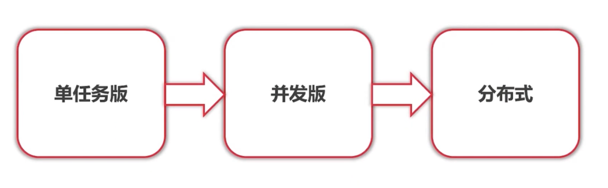
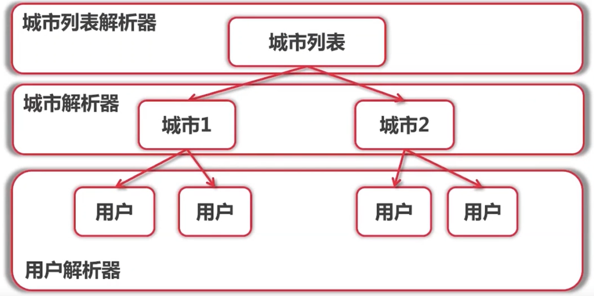
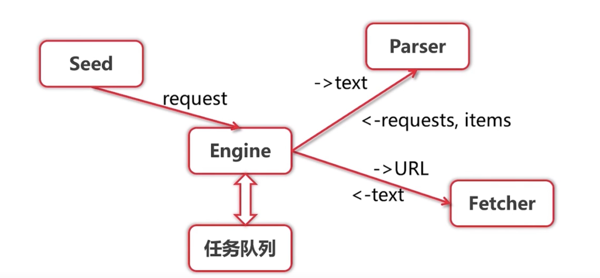
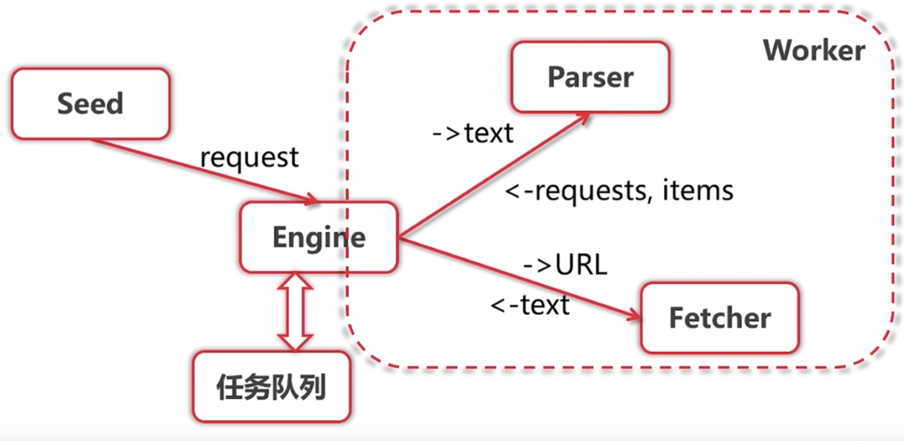
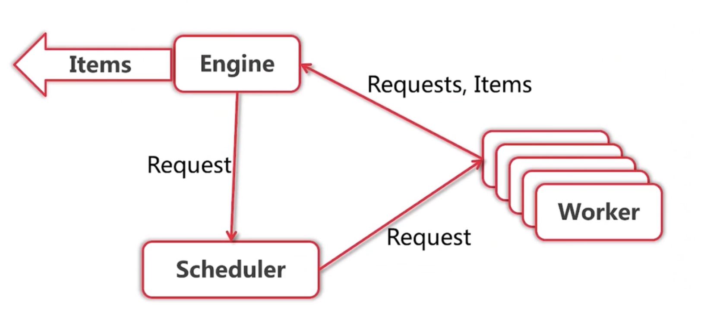
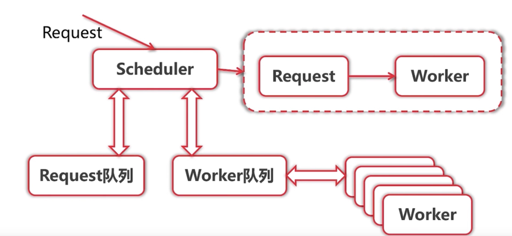
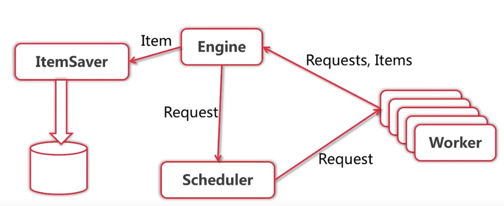

## 总结



### Version1（单任务版）

#### Step1 分析所需要爬取的网站信息

拉取第一页网页信息，拉取网页源码分析，设计对应的正则表达式，测试拉取信息正确与否

#### Step2 确定单任务爬虫结构

确定网页结构，以及爬虫结构




具体的工作流程为：给定一个起始网址，加入任务队列，engine拿去url将任务发给Fetcher拉取url对应网页，调用对应层级的解析器解析数据并把新的url加入任务队列。（这里利用go的函数特性，将对应的解析器与request封装在一起加入队列，可以非常方便的调用对应的解析器）



#### step3 编码测试

编码测试

问题:engine需要等待单个fetcher拉取网页数据（而网络I/O耗时很久）

### Version2(并发版)

解决其他任务等待fetcher网络I/O速度慢的问题

#### Step1 并发设计

知道了fetcherer这个模块最耗时，现在的解决方法就是将Fetcher抽离出去，开goroutine来处理这个网络I/O

任务与解析器是封装在一个结构体，可以直接将两个操作一起放入goroutine封装成一个worker



```go
func Worker(r Request) (ParseResult,error) {
	log.Printf("Fetching url:%v",r.Url)
	body , err := fetcher.Fetch(r.Url)
	if err!=nil{
		log.Fatal("Fetcher err:",r.Url,err)
		return ParseResult{},nil
	}
	return r.ParserFunc(body),nil
}
```

所以并发版的的设计为：



增加一个调度器，管理任务的分发（如果不增加一个Scheduler那么engine和Worker就还是串行的了）

```go
func (e *ConEngine) Run(seeds ...Request) {
	out := make(chan ParseResult,10)
    //创建一个分发任务给worker的channel
	e.Scheduler.Run()
	for i := 0;i < e.WorkerCount;i++{
        //创建worker
createWorker(e.Scheduler.WorkerChan(),out,e.Scheduler)
	}
   //将初始任务交给Schedual
	for _,r := range seeds{
		e.Scheduler.Submit(r)
	}

    //从Worker里面读取解析好的数据并给engine
	for {
		result := <-out
		for _,item := range result.Items{
            log.Printf("Got item %v:",item)  
		}
		//将新获得的任务交给Schedual进行调度
		for _,request := range result.Requests{
			e.Scheduler.Submit(request)
		}
	}
}

func createWorker(in chan Request,out chan ParseResult) {
	go func() {
		for{
			//收任务
			request := <-in
            //工作
			worker,err := Worker(request)
			if err != nil{
				continue
			}
            //发出任务
			out<-worker
		}
	}()
}
```


```go
func (ssche *SimpleScheduler)Submit(r engine.Request)  {
	ssche.workerChan <- r
}
func (ssche *SimpleScheduler)Run()  {
	ssche.workerChan = make(chan engine.Request)
}

func (ssche *SimpleScheduler)WorkerChan()chan engine.Request {
	return ssche.workerChan
}
```

#### Step2 bug解决

去重问题（如果将数据量不大，可以直接定义一个map直接在内存中就去重）或是将url存在redis 集合里面 使用redis集合去重

循坏等待，死锁问题

1. 这里Scheduler要将任务发给Worker的时候要保证in这个channel的接收队列还挂着Worker（就是还有空闲的Worker）

2. 但是Worker要做完一个任务的前提是需要将自己做完的结果成功通过out发送给engine

3. 但是engine接收这个结果的时候又需要将获得的任务中的request交给scheduler去调度
4. 但是1中的Scheduler还还有任务等着去发给Woker，这时新的任务又来了，然后就会在这卡住。

这样就产生了一个循环等待的问题。

**那么怎么解决呢？**

一个很简单的想法就是破坏这个循环等待，

直接开一个goroutine来发送任务就好了（gorountine的特性：会立刻在主函数里返回，然后去做自己的事情）这样就不会在上文中的4卡住，每次来一个request，都开一个goroutine去解决，然后立刻开始处理下一个request

```go
func (ssche *SimpleScheduler)Submit(r engine.Request)  {
	go func() {ssche.workerChan <- r}()
}
```


在使用并发以后，爬取数据的速度明显提高不少，但随之而来的就是网站的限流和封ip。。这俄格问题，可以通过更换代理、更换代理IP、加一个ticker来限速等方法处理。


#### Step3 结构优化

但是这里还是有一个问题，这里Scheduler创建的子goroutine和所有的woker都是在共用一个goroutine，一边抢着发，一边也抢着收，这显然不是我们想要的。

所以我们可以给每一个worker创建它独有的channel，（这个channel就可以代表worker）然后再设计一个channel，来用来接收worker的channel（相当于一个总控的channel）（在创建worker的时候呢把自己的channel发给这个发给这个总控的channel，说明我可以开始工作了）

```go
func (q *QueueScheduler)WorkerReady(w chan engine.Request)  {
	q.workerChan <- w
}
```


这里可以设计两个队列，一个存放需要发出的Request,一个存放接收Request的Worker



```go
func (q *QueueScheduler)Run() {
	//初始化两个channel
	q.workerChan = make(chan chan engine.Request)
	q.requestChan = make(chan engine.Request)
	go func() {
		//对应的两个队列
		var requestQ []engine.Request
		var workerQ []chan engine.Request
		for{
			//获取队首的request和空闲worker
			var activeRequest engine.Request
			var activeWorker chan engine.Request
			if len(requestQ)>0&&len(workerQ)>0{
				activeWorker = workerQ[0]
				activeRequest = requestQ[0]
			}
			select {
				//如果接收到request，把request加入request队列
				case r := <-q.requestChan:
					requestQ = append(requestQ,r) 
				//如果接收到worker的channel（说明这个worker空闲下来了），把这个加入队列
				case w:=<-q.workerChan:
					workerQ = append(workerQ,w)
					//如果可以成功将request送入wokerchannel,各自队列中的元素出队
				case activeWorker<-activeRequest:
					workerQ = workerQ[1:]
					requestQ = requestQ[1:]
			}
		}

	}()
}
```

```go
go func() {
		for{
            //每次收到任务，处理任务，做完任务以后，就告诉Scheduler我又可以了
			ready.WorkerReady(in)
			request := <-in
			worker,err := Worker(request)
			if err != nil{
				continue
			}
			out<-worker
		}
	}()
```


#### step4存储爬取的信息

```go
func (e *ConEngine) Run(seeds ...Request) {
	out := make(chan ParseResult,10)
	e.Scheduler.Run()
	for i := 0;i < e.WorkerCount;i++{
		createWorker(e.Scheduler.WorkerChan(),out,e.Scheduler)
	}

	for _,r := range seeds{
		e.Scheduler.Submit(r)
	}

	for {
		result := <-out
		for _,item := range result.Items{
            //将数据发出去，让对应的存储模块存储数据
			go func() {
				e.ItemChan<- item
			}()
		}

		for _,request := range result.Requests{
			e.Scheduler.Submit(request)
		}
	}
}
```




这里的存储使用elasticsearch（本身提供搜索功能，可以直接存储json数据）


## Version3(分布式版)

#### Step1:分析分布式架构

可以看到会影响系统性能的就是 ItemSaver 和Worker（这两个都会使用I/O）所以可以很容易的想到将这两个模块独立出去，发布到其他的服务器上提供服务。

这里可以是使用 rpc  消息队列等技术进行服务。

这里先使用rpc

#### Step2 分离ItemSaver服务

这里选用了较为简单的jsonrpc（官方自带的跨语言rpc）

```go
//包装save方法为rpc服务
func (saver ItemSaverService)Save(item engine.Item,result *string)error {
	err := presist.Save(item,saver.Client,saver.Index)
	log.Printf("Item %v saved",item)
	if err == nil {
		*result = "ok"
	}else {
		log.Printf("Error saving %v,%s",item,err)
	}
	return err
}
```

```go
//注册初始化rpc服务
func serveRpc(host string,index string) error {
    //创建elsticsearch的客户端
   client, err := elastic.NewClient(elastic.SetSniff(false),
      elastic.SetURL(config.Host))
   if err != nil{
      return err
   }
   return 
	 //注册服务
    rpc_support.ServiceRpc(host,&persistRpc.ItemSaverService{
      Client: client,
      Index:  index,
   })
}
```

```go
func ItemSaver(host string)(chan engine.Item ,error){
	out := make(chan engine.Item)
	client, err := rpc_support.NewClient(host)
	if err !=nil {
		return nil,err
	}
	if err !=nil {
		return nil,err
	}
	go func() {
		itemCount := 1
		for {
			item := <- out
			log.Printf("Item Saver:got item #%d %v",itemCount,item)
			itemCount++
			//call rpc save item
			result := ""
            //调用rpc服务
			err = client.Call(config.ItemSaverService,item,&result)
			if err != nil || result != "ok"{
				log.Printf("result: %s",result)
			}
			if err != nil{
				log.Printf("Item save error : %v,%s",item,err)
			}
		}
	}()
	return out,nil
}
```

#### Step3 分离Worker服务

待定
